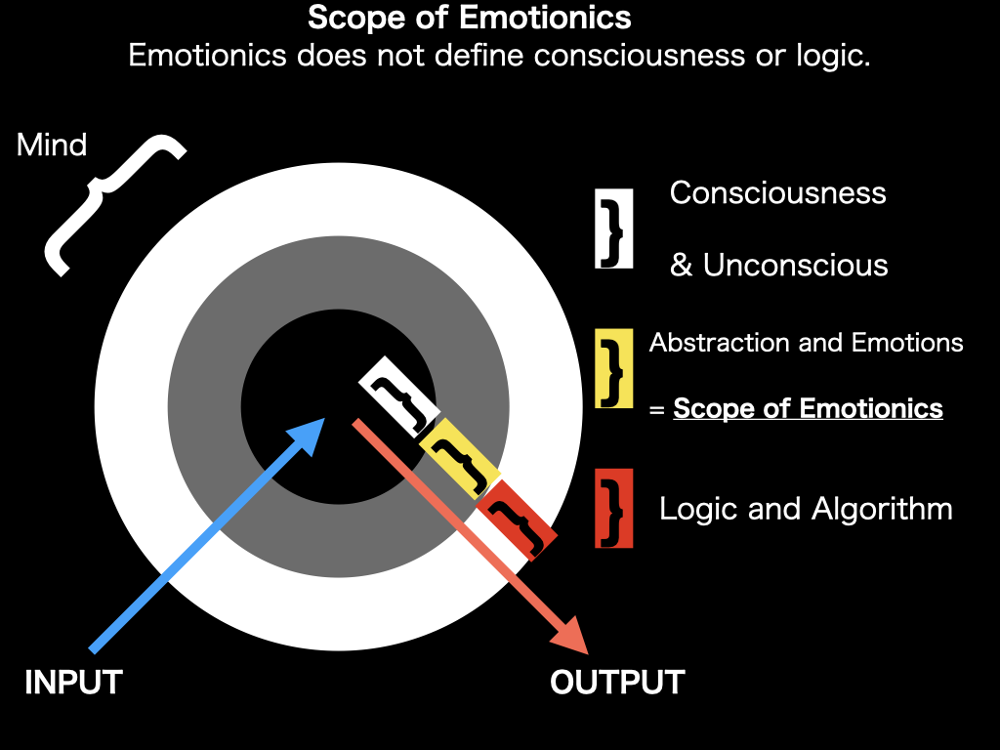

# Scope of Emotionics

Emotionics bridges abstraction and emotions between consciousness and logic.
It does not define consciousness or logic, and does not perform intervention.

## What Emotionics Covers
- Abstraction of emotional signals
- Observation of expressed emotions (OUTPUT side)
- Temporal and contextual interpretation

## What Emotionics Does Not Cover
- Definition of consciousness or unconsciousness
- Manipulation of internal emotional states
- Decision-making logic or algorithms

## Why This Boundary Matters

This boundary is intentional.

Emotionics is designed to remain an observational and interpretive framework.
Expanding its scope beyond this boundary would blur the distinction between
understanding emotions and intervening in them.

Intervention in emotional states requires different responsibilities,
ethical considerations, and safeguards.
Without clear boundaries, technologies intended for understanding
can be repurposed for manipulation.

By explicitly limiting its scope, Emotionics prioritizes safety,
interpretability, and trust over capability expansion.

## Diagram

